# Diagramas de Flujo Individuales por Caso de Uso (30 Diagramas)

Cada operación del sistema (6 métodos base por entidad + navegación de relaciones) cuenta con su propio diagrama de flujo independiente.

---

## Módulo Persona (`PersonUseCase`)

### 1. Persona — `findAll()` (Listar todos)
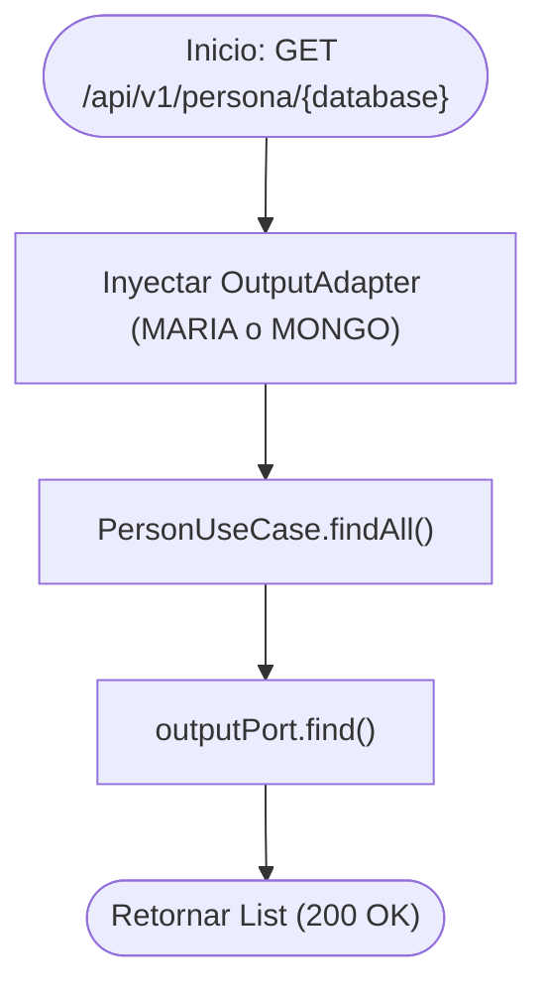
```mermaid
flowchart TD
    A(["Inicio: GET /api/v1/persona/{database}"]) --> B["Inyectar OutputAdapter (MARIA o MONGO)"]
    B --> C["PersonUseCase.findAll()"]
    C --> D["outputPort.find()"]
    D --> E(["Retornar List<Person> (200 OK)"])
```

### 2. Persona — `findOne(cc)` (Buscar por ID)
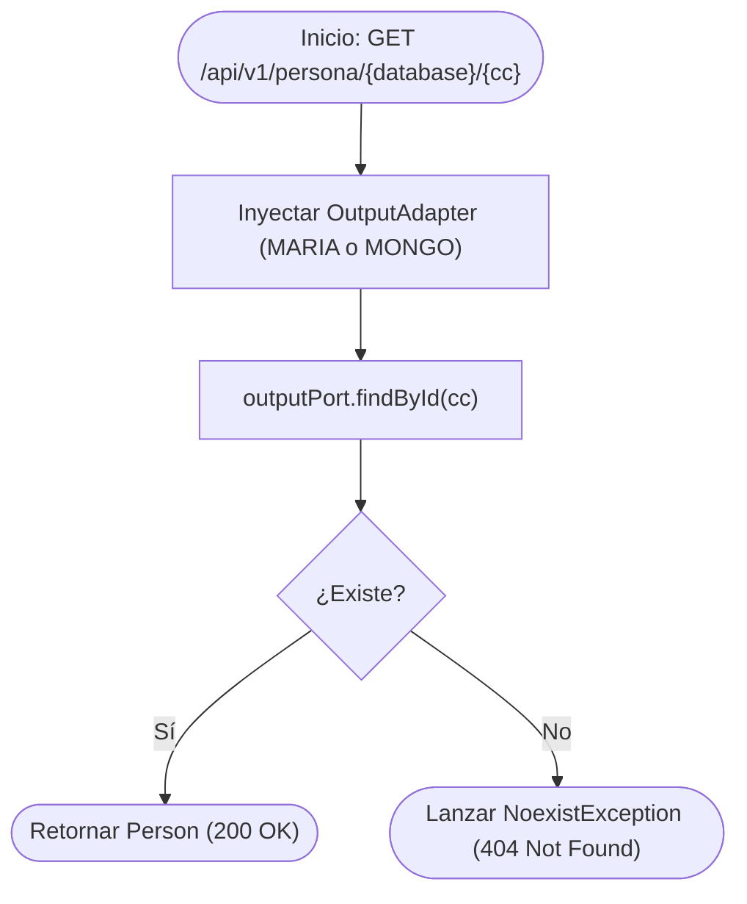
```mermaid
flowchart TD
    A(["Inicio: GET /api/v1/persona/{database}/{cc}"]) --> B["Inyectar OutputAdapter (MARIA o MONGO)"]
    B --> C["outputPort.findById(cc)"]
    C --> D{"¿Existe?"}
    D -- "Sí" --> E(["Retornar Person (200 OK)"])
    D -- "No" --> F(["Lanzar NoexistException (404 Not Found)"])
```

### 3. Persona — `count()` (Contar registros)
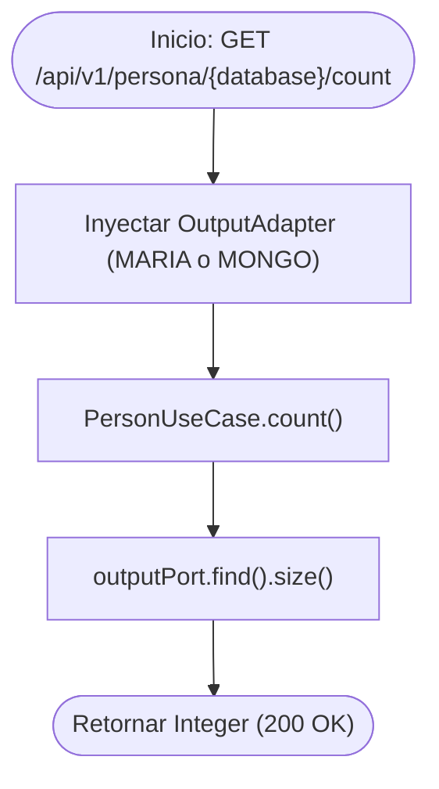
```mermaid
flowchart TD
    A(["Inicio: GET /api/v1/persona/{database}/count"]) --> B["Inyectar OutputAdapter (MARIA o MONGO)"]
    B --> C["PersonUseCase.count()"]
    C --> D["outputPort.find().size()"]
    D --> E(["Retornar Integer (200 OK)"])
```

### 4. Persona — `create(Person)` (Crear registro)

```mermaid
flowchart TD
    A(["Inicio: POST /api/v1/persona"]) --> B{"¿Payload @Valid?"}
    B -- "No" --> C(["GlobalExceptionHandler (400 Bad Request)"])
    B -- "Sí" --> D["Inyectar OutputAdapter (MARIA o MONGO)"]
    D --> E["outputPort.save(Person)"]
    E --> F(["Retornar Person creado (200/201)"])
```

### 5. Persona — `edit(cc, Person)` (Editar registro)
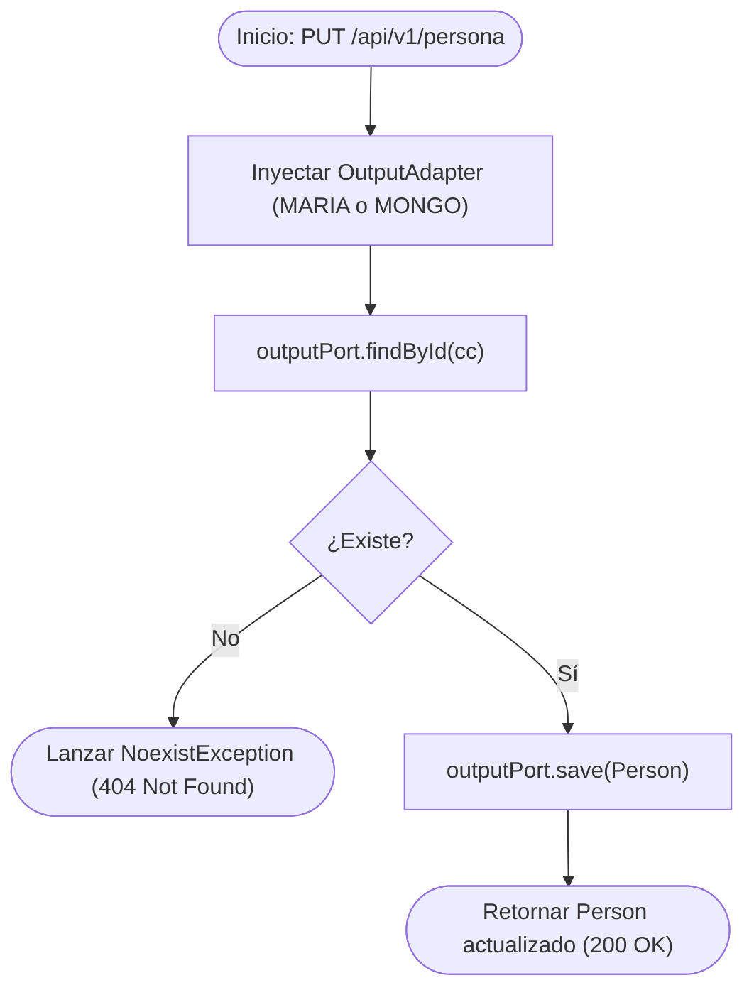
```mermaid
flowchart TD
    A(["Inicio: PUT /api/v1/persona"]) --> B["Inyectar OutputAdapter (MARIA o MONGO)"]
    B --> C["outputPort.findById(cc)"]
    C --> D{"¿Existe?"}
    D -- "No" --> E(["Lanzar NoexistException (404 Not Found)"])
    D -- "Sí" --> F["outputPort.save(Person)"]
    F --> G(["Retornar Person actualizado (200 OK)"])
```

### 6. Persona — `drop(cc)` (Eliminar registro)
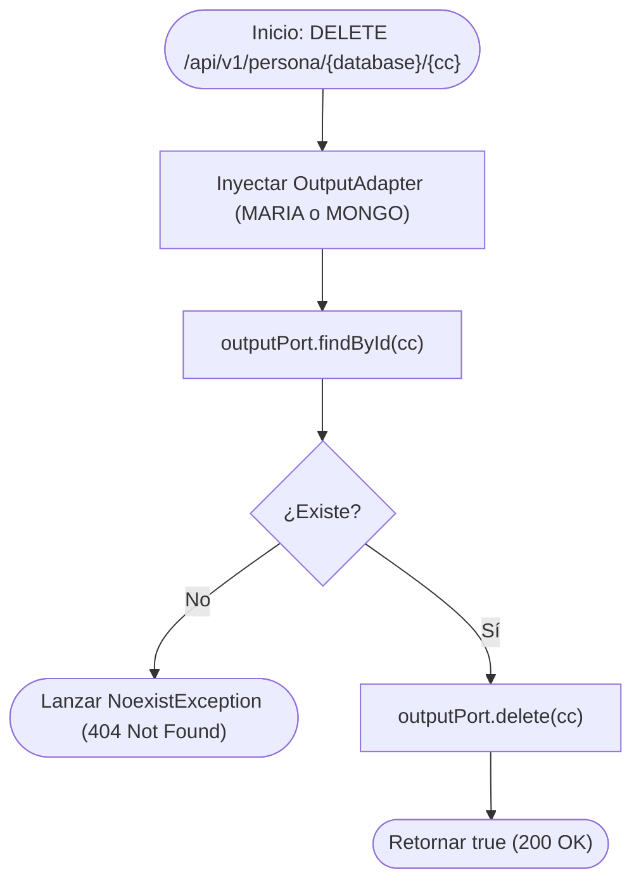
```mermaid
flowchart TD
    A(["Inicio: DELETE /api/v1/persona/{database}/{cc}"]) --> B["Inyectar OutputAdapter (MARIA o MONGO)"]
    B --> C["outputPort.findById(cc)"]
    C --> D{"¿Existe?"}
    D -- "No" --> E(["Lanzar NoexistException (404 Not Found)"])
    D -- "Sí" --> F["outputPort.delete(cc)"]
    F --> G(["Retornar true (200 OK)"])
```

### 7. Persona — `findPhones(cc)` (Consultar Teléfonos de una Persona)

```mermaid
flowchart TD
    A(["Inicio: GET relación findPhones"]) --> B["Inyectar OutputAdapter (MARIA o MONGO)"]
    B --> C["outputPort.findById(cc)"]
    C --> D{"¿Existe?"}
    D -- "No" --> E(["Lanzar NoexistException (404 Not Found)"])
    D -- "Sí" --> F(["Retornar List<Phone> (200 OK)"])
```

### 8. Persona — `findStudies(cc)` (Consultar Estudios de una Persona)

```mermaid
flowchart TD
    A(["Inicio: GET relación findStudies"]) --> B["Inyectar OutputAdapter (MARIA o MONGO)"]
    B --> C["outputPort.findById(cc)"]
    C --> D{"¿Existe?"}
    D -- "No" --> E(["Lanzar NoexistException (404 Not Found)"])
    D -- "Sí" --> F(["Retornar List<Study> (200 OK)"])
```

---

## Módulo Profesión (`ProfessionUseCase`)

### 9. Profesión — `findAll()` (Listar todos)
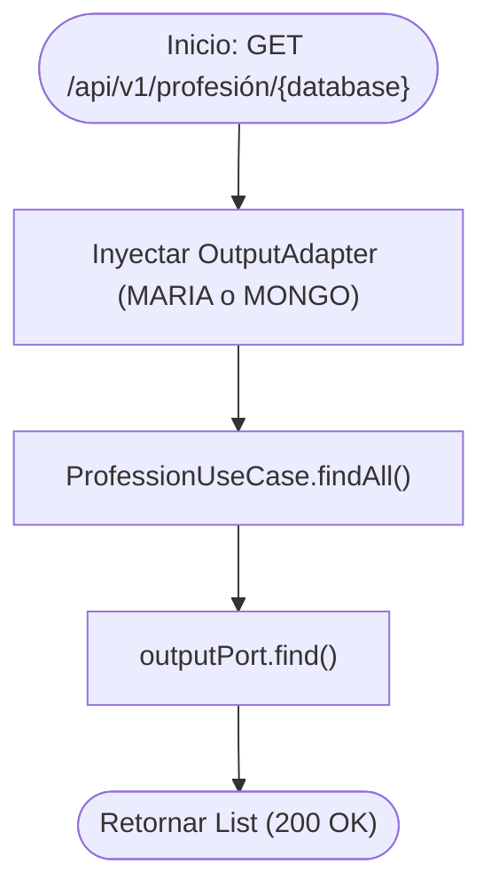
```mermaid
flowchart TD
    A(["Inicio: GET /api/v1/profesión/{database}"]) --> B["Inyectar OutputAdapter (MARIA o MONGO)"]
    B --> C["ProfessionUseCase.findAll()"]
    C --> D["outputPort.find()"]
    D --> E(["Retornar List<Profession> (200 OK)"])
```

### 10. Profesión — `findOne(id)` (Buscar por ID)
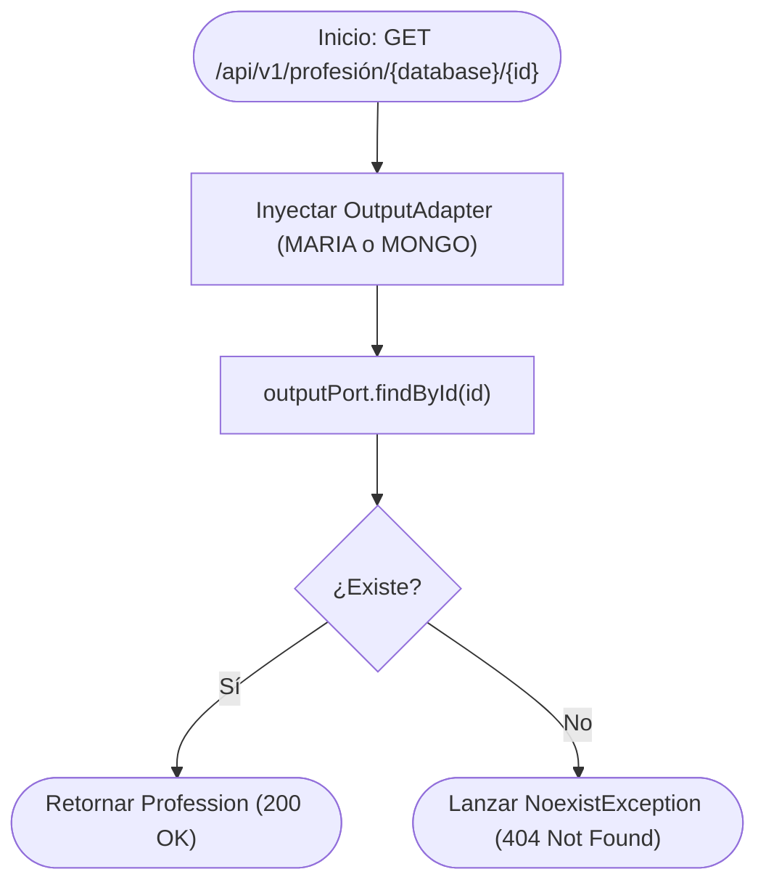
```mermaid
flowchart TD
    A(["Inicio: GET /api/v1/profesión/{database}/{id}"]) --> B["Inyectar OutputAdapter (MARIA o MONGO)"]
    B --> C["outputPort.findById(id)"]
    C --> D{"¿Existe?"}
    D -- "Sí" --> E(["Retornar Profession (200 OK)"])
    D -- "No" --> F(["Lanzar NoexistException (404 Not Found)"])
```

### 11. Profesión — `count()` (Contar registros)
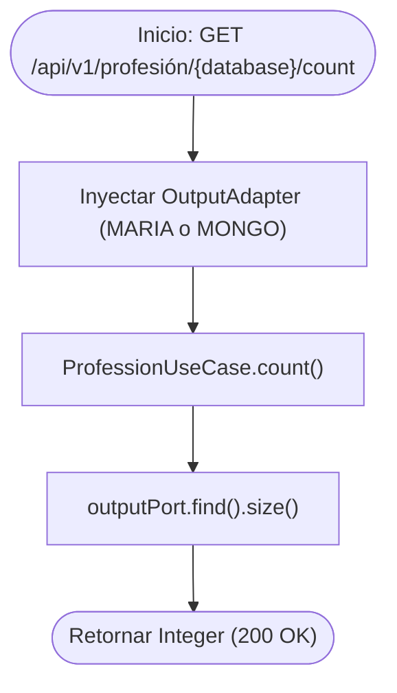
```mermaid
flowchart TD
    A(["Inicio: GET /api/v1/profesión/{database}/count"]) --> B["Inyectar OutputAdapter (MARIA o MONGO)"]
    B --> C["ProfessionUseCase.count()"]
    C --> D["outputPort.find().size()"]
    D --> E(["Retornar Integer (200 OK)"])
```

### 12. Profesión — `create(Profession)` (Crear registro)
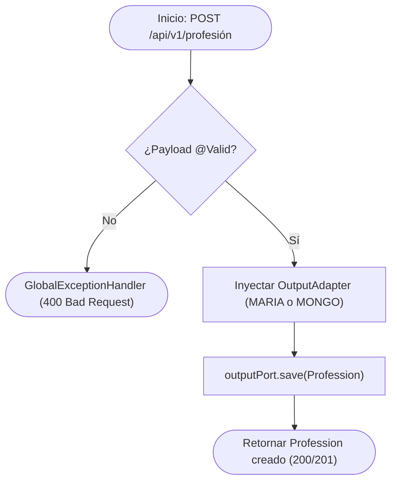
```mermaid
flowchart TD
    A(["Inicio: POST /api/v1/profesión"]) --> B{"¿Payload @Valid?"}
    B -- "No" --> C(["GlobalExceptionHandler (400 Bad Request)"])
    B -- "Sí" --> D["Inyectar OutputAdapter (MARIA o MONGO)"]
    D --> E["outputPort.save(Profession)"]
    E --> F(["Retornar Profession creado (200/201)"])
```

### 13. Profesión — `edit(id, Profession)` (Editar registro)
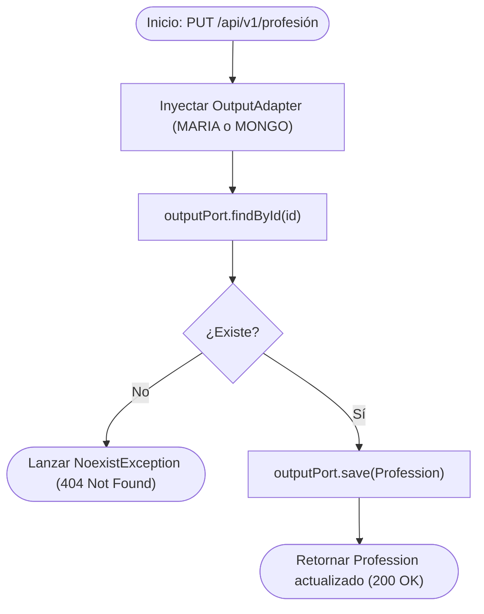
```mermaid
flowchart TD
    A(["Inicio: PUT /api/v1/profesión"]) --> B["Inyectar OutputAdapter (MARIA o MONGO)"]
    B --> C["outputPort.findById(id)"]
    C --> D{"¿Existe?"}
    D -- "No" --> E(["Lanzar NoexistException (404 Not Found)"])
    D -- "Sí" --> F["outputPort.save(Profession)"]
    F --> G(["Retornar Profession actualizado (200 OK)"])
```

### 14. Profesión — `drop(id)` (Eliminar registro)
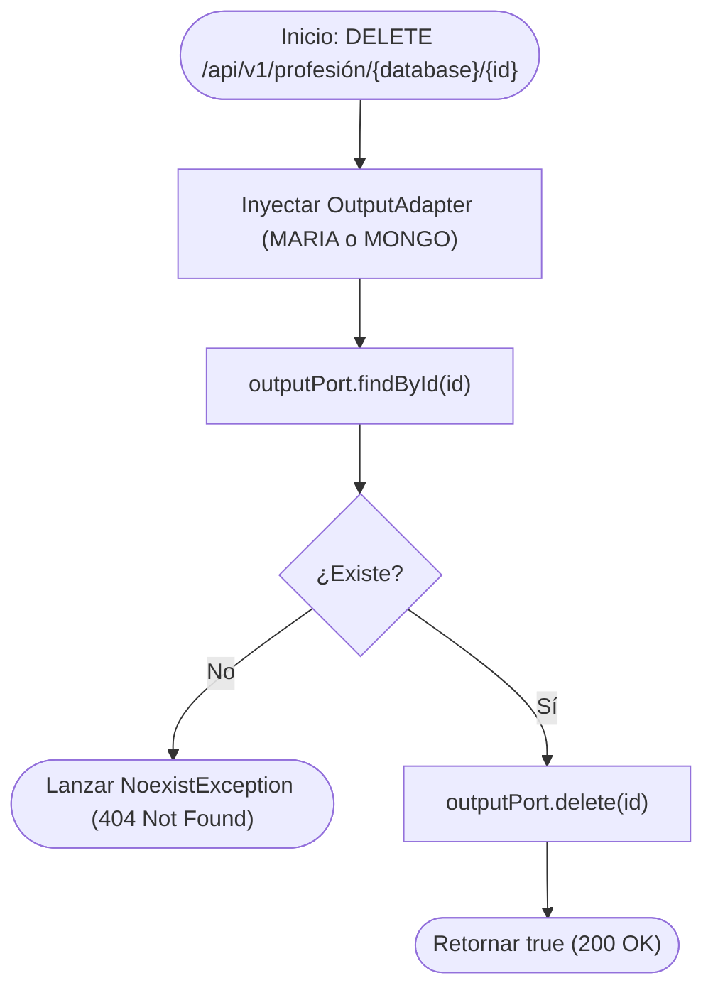
```mermaid
flowchart TD
    A(["Inicio: DELETE /api/v1/profesión/{database}/{id}"]) --> B["Inyectar OutputAdapter (MARIA o MONGO)"]
    B --> C["outputPort.findById(id)"]
    C --> D{"¿Existe?"}
    D -- "No" --> E(["Lanzar NoexistException (404 Not Found)"])
    D -- "Sí" --> F["outputPort.delete(id)"]
    F --> G(["Retornar true (200 OK)"])
```

### 15. Profesión — `findStudies(id)` (Consultar Estudios de una Profesión)
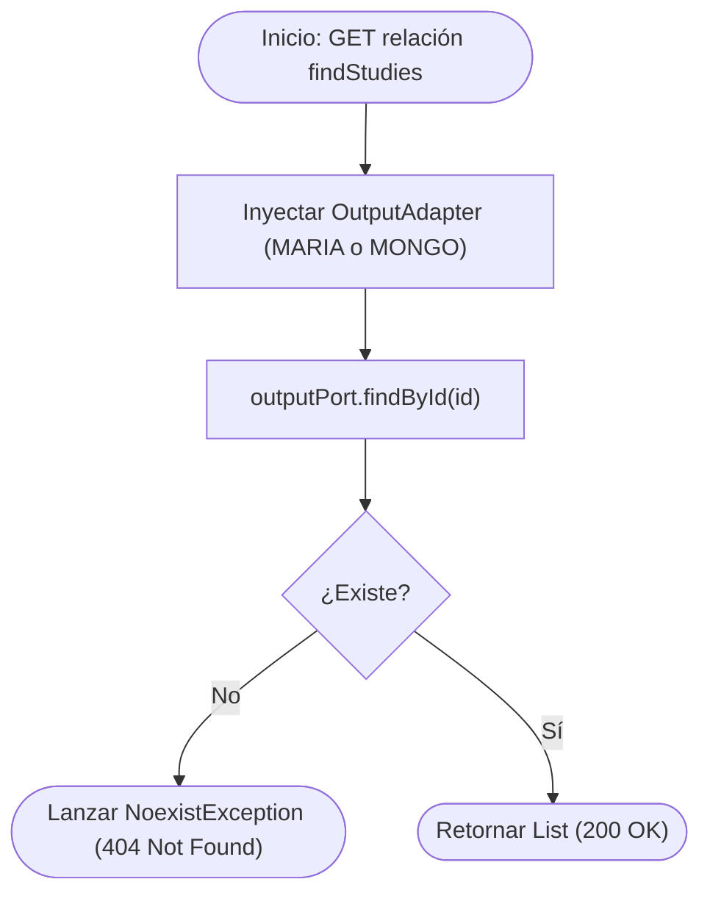
```mermaid
flowchart TD
    A(["Inicio: GET relación findStudies"]) --> B["Inyectar OutputAdapter (MARIA o MONGO)"]
    B --> C["outputPort.findById(id)"]
    C --> D{"¿Existe?"}
    D -- "No" --> E(["Lanzar NoexistException (404 Not Found)"])
    D -- "Sí" --> F(["Retornar List<Study> (200 OK)"])
```

---

## Módulo Teléfono (`PhoneUseCase`)

### 16. Teléfono — `findAll()` (Listar todos)

```mermaid
flowchart TD
    A(["Inicio: GET /api/v1/teléfono/{database}"]) --> B["Inyectar OutputAdapter (MARIA o MONGO)"]
    B --> C["PhoneUseCase.findAll()"]
    C --> D["outputPort.find()"]
    D --> E(["Retornar List<Phone> (200 OK)"])
```

### 17. Teléfono — `findOne(num)` (Buscar por ID)
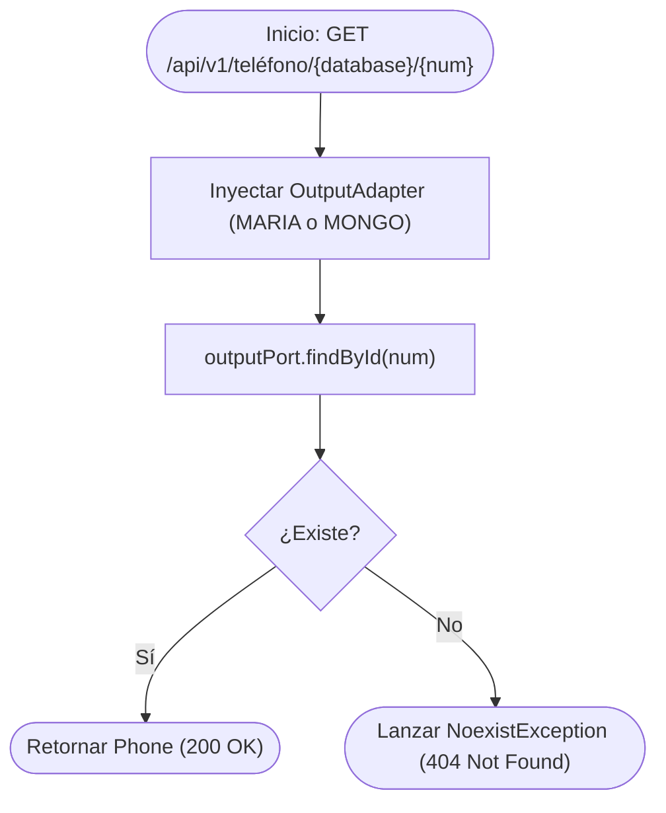
```mermaid
flowchart TD
    A(["Inicio: GET /api/v1/teléfono/{database}/{num}"]) --> B["Inyectar OutputAdapter (MARIA o MONGO)"]
    B --> C["outputPort.findById(num)"]
    C --> D{"¿Existe?"}
    D -- "Sí" --> E(["Retornar Phone (200 OK)"])
    D -- "No" --> F(["Lanzar NoexistException (404 Not Found)"])
```

### 18. Teléfono — `count()` (Contar registros)
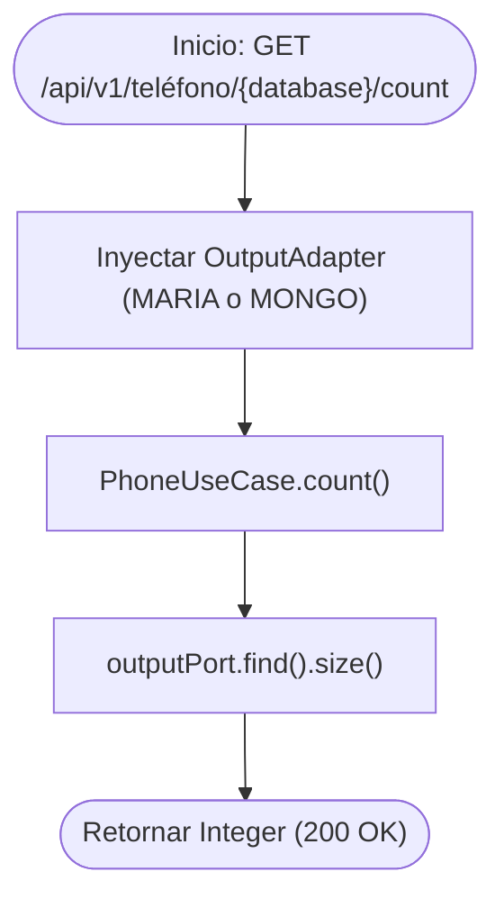
```mermaid
flowchart TD
    A(["Inicio: GET /api/v1/teléfono/{database}/count"]) --> B["Inyectar OutputAdapter (MARIA o MONGO)"]
    B --> C["PhoneUseCase.count()"]
    C --> D["outputPort.find().size()"]
    D --> E(["Retornar Integer (200 OK)"])
```

### 19. Teléfono — `create(Phone)` (Crear registro)
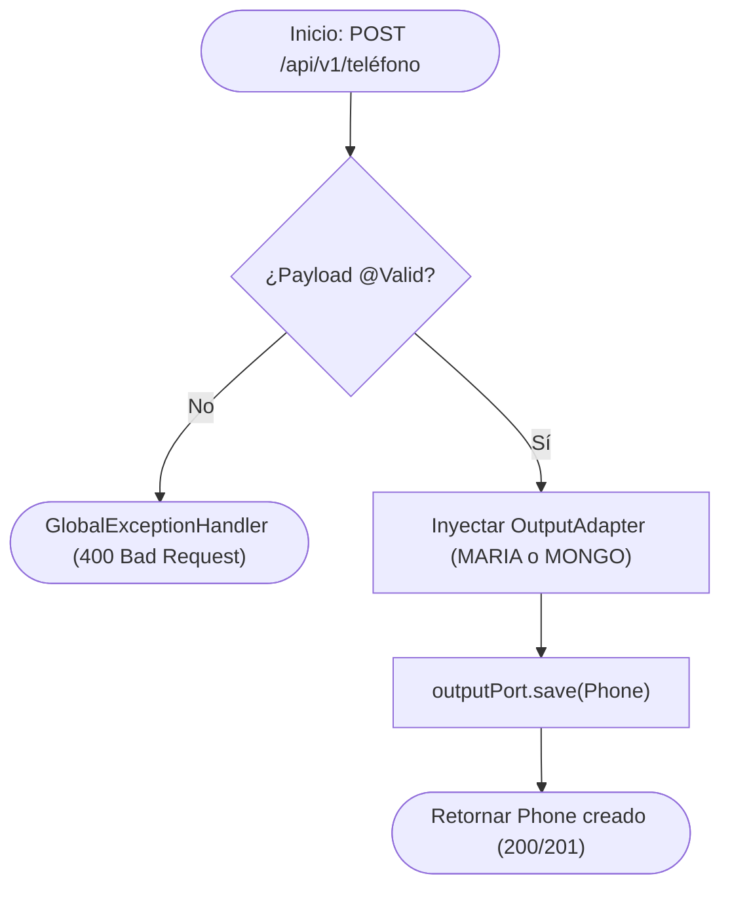
```mermaid
flowchart TD
    A(["Inicio: POST /api/v1/teléfono"]) --> B{"¿Payload @Valid?"}
    B -- "No" --> C(["GlobalExceptionHandler (400 Bad Request)"])
    B -- "Sí" --> D["Inyectar OutputAdapter (MARIA o MONGO)"]
    D --> E["outputPort.save(Phone)"]
    E --> F(["Retornar Phone creado (200/201)"])
```

### 20. Teléfono — `edit(num, Phone)` (Editar registro)
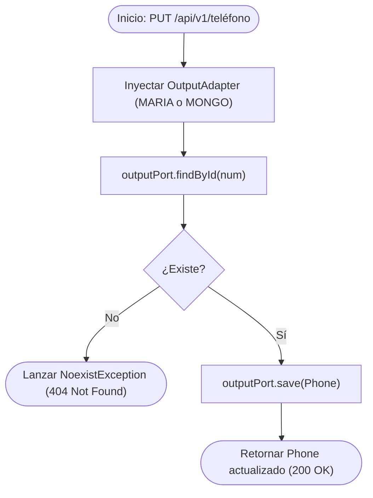
```mermaid
flowchart TD
    A(["Inicio: PUT /api/v1/teléfono"]) --> B["Inyectar OutputAdapter (MARIA o MONGO)"]
    B --> C["outputPort.findById(num)"]
    C --> D{"¿Existe?"}
    D -- "No" --> E(["Lanzar NoexistException (404 Not Found)"])
    D -- "Sí" --> F["outputPort.save(Phone)"]
    F --> G(["Retornar Phone actualizado (200 OK)"])
```

### 21. Teléfono — `drop(num)` (Eliminar registro)
```mermaid
flowchart TD
    A(["Inicio: DELETE /api/v1/teléfono/{database}/{num}"]) --> B["Inyectar OutputAdapter (MARIA o MONGO)"]
    B --> C["outputPort.findById(num)"]
    C --> D{"¿Existe?"}
    D -- "No" --> E(["Lanzar NoexistException (404 Not Found)"])
    D -- "Sí" --> F["outputPort.delete(num)"]
    F --> G(["Retornar true (200 OK)"])
```

### 22. Teléfono — `findOwner(num)` (Consultar Dueño de un Teléfono)
```mermaid
flowchart TD
    A(["Inicio: GET relación findOwner"]) --> B["Inyectar OutputAdapter (MARIA o MONGO)"]
    B --> C["outputPort.findById(num)"]
    C --> D{"¿Existe?"}
    D -- "No" --> E(["Lanzar NoexistException (404 Not Found)"])
    D -- "Sí" --> F(["Retornar Person (200 OK)"])
```

---

## Módulo Estudios (`StudyUseCase`)

### 23. Estudios — `findAll()` (Listar todos)
```mermaid
flowchart TD
    A(["Inicio: GET /api/v1/estudios/{database}"]) --> B["Inyectar OutputAdapter (MARIA o MONGO)"]
    B --> C["StudyUseCase.findAll()"]
    C --> D["outputPort.find()"]
    D --> E(["Retornar List<Study> (200 OK)"])
```

### 24. Estudios — `findOne(idProf, ccPer)` (Buscar por ID)
```mermaid
flowchart TD
    A(["Inicio: GET /api/v1/estudios/{database}/{idProf, ccPer}"]) --> B["Inyectar OutputAdapter (MARIA o MONGO)"]
    B --> C["outputPort.findById(idProf, ccPer)"]
    C --> D{"¿Existe?"}
    D -- "Sí" --> E(["Retornar Study (200 OK)"])
    D -- "No" --> F(["Lanzar NoexistException (404 Not Found)"])
```

### 25. Estudios — `count()` (Contar registros)
```mermaid
flowchart TD
    A(["Inicio: GET /api/v1/estudios/{database}/count"]) --> B["Inyectar OutputAdapter (MARIA o MONGO)"]
    B --> C["StudyUseCase.count()"]
    C --> D["outputPort.find().size()"]
    D --> E(["Retornar Integer (200 OK)"])
```

### 26. Estudios — `create(Study)` (Crear registro)
```mermaid
flowchart TD
    A(["Inicio: POST /api/v1/estudios"]) --> B{"¿Payload @Valid?"}
    B -- "No" --> C(["GlobalExceptionHandler (400 Bad Request)"])
    B -- "Sí" --> D["Inyectar OutputAdapter (MARIA o MONGO)"]
    D --> E["outputPort.save(Study)"]
    E --> F(["Retornar Study creado (200/201)"])
```

### 27. Estudios — `edit(idProf, ccPer, Study)` (Editar registro)
```mermaid
flowchart TD
    A(["Inicio: PUT /api/v1/estudios"]) --> B["Inyectar OutputAdapter (MARIA o MONGO)"]
    B --> C["outputPort.findById(idProf, ccPer)"]
    C --> D{"¿Existe?"}
    D -- "No" --> E(["Lanzar NoexistException (404 Not Found)"])
    D -- "Sí" --> F["outputPort.save(Study)"]
    F --> G(["Retornar Study actualizado (200 OK)"])
```

### 28. Estudios — `drop(idProf, ccPer)` (Eliminar registro)
```mermaid
flowchart TD
    A(["Inicio: DELETE /api/v1/estudios/{database}/{idProf, ccPer}"]) --> B["Inyectar OutputAdapter (MARIA o MONGO)"]
    B --> C["outputPort.findById(idProf, ccPer)"]
    C --> D{"¿Existe?"}
    D -- "No" --> E(["Lanzar NoexistException (404 Not Found)"])
    D -- "Sí" --> F["outputPort.delete(idProf, ccPer)"]
    F --> G(["Retornar true (200 OK)"])
```

### 29. Estudios — `findPerson(idProf, ccPer)` (Consultar Persona de un Estudio)
```mermaid
flowchart TD
    A(["Inicio: GET relación findPerson"]) --> B["Inyectar OutputAdapter (MARIA o MONGO)"]
    B --> C["outputPort.findById(idProf, ccPer)"]
    C --> D{"¿Existe?"}
    D -- "No" --> E(["Lanzar NoexistException (404 Not Found)"])
    D -- "Sí" --> F(["Retornar Person (200 OK)"])
```

### 30. Estudios — `findProfession(idProf, ccPer)` (Consultar Profesión de un Estudio)
```mermaid
flowchart TD
    A(["Inicio: GET relación findProfession"]) --> B["Inyectar OutputAdapter (MARIA o MONGO)"]
    B --> C["outputPort.findById(idProf, ccPer)"]
    C --> D{"¿Existe?"}
    D -- "No" --> E(["Lanzar NoexistException (404 Not Found)"])
    D -- "Sí" --> F(["Retornar Profession (200 OK)"])
```
